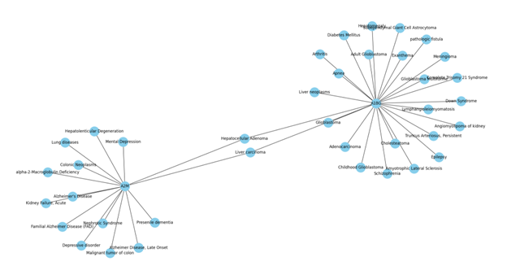
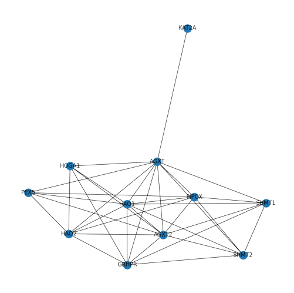
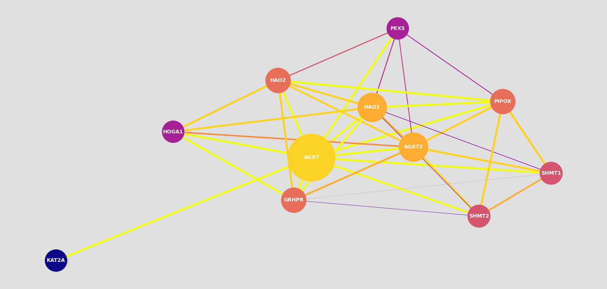
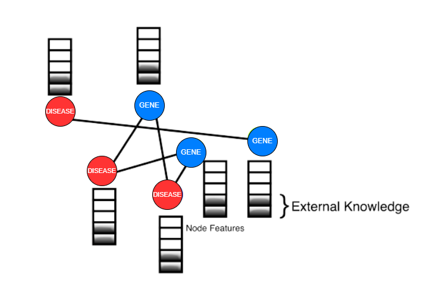

# Gene-Disease Association Analysis  
- From Data to Discovery: A learning architecture for Studying Gene-Disease Association

This repository contains the code and data for analyzing gene-disease associations using Graph Neural Networks (GNNs). This project aims to predict gene-disease associations based on protein-protein interaction (PPI) data and additional node features.

<!-- Insert a relevant image related to your project here -->

## Dataset

The dataset used in this project is derived from DisGeNET, a comprehensive gene-disease association database. The dataset includes gene information, disease information, and protein-protein interaction data.

## Preprocessing

The dataset undergoes preprocessing and preparation before being used for computations. Unnecessary features such as 'stringId_A', 'stringId_B', 'ncbiTaxonId', and 'ID' are dropped, and only the protein-protein interaction data and respective interaction scores are kept. The dataset is a graph, where proteins are nodes and edges indicate the interaction between two proteins.
How a GENE Network Graph look:   

How a Protein-Protein Interaction Network look:

## Models

Two architectures are used in this project: Graph Convolutional Network (GCN)-based architecture and Attention-based architecture. The GCN-based architecture utilizes GraphSAGE, which samples neighborhoods in 'n' hops and aggregates feature information from a node's local neighborhood. The Attention-based architecture uses Graph Attention Networks (GAT), which apply self-attention to each node with every other node in the graph and aggregates features from multiple attention heads.
.png)

## Experimental Setup & Training

A total of 12 models are trained on different datasets and architectures. The training is performed on a single GPU with 12 GB memory. Baseline models such as Random Forest, SVM, and Multi-Layer Perceptron (MLP) are also included for comparison. Negative sampling is performed to handle the heterogeneity of the graph data.

## Results

The performance of the models is evaluated using metrics such as AUC-ROC, F1 Score, Precision, and Recall. Results are provided for datasets with and without additional node features. GraphSAGE and GAT models improve performance when additional node features are considered. GAT consistently outperforms GraphSAGE and the baseline models, especially when utilizing PPI data.

### Results (w/o additional node features)

Model | Dataset Size | AUC-ROC | F1 Score | Precision | Recall
--- | --- | --- | --- | --- | ---
GraphSAGE | 1k | 0.825 | 0.6798 | 0.7097 | 0.6523
GraphSAGE | 5k | 0.547 | 0.023 | 0.5211 | 0.0116
GraphSAGE | 10k | 0.5460 | 0.019 | 0.4765 | 0.0095
GAT | 1k | 0.7915 | 0.6385 | 0.5930 | 0.6916
GAT | 5k | 0.8467 | 0.6901 | 0.6492 | 0.741
GAT | 10k | 0.8415 | 0.6296 | 0.7005 | 0.5717

### Results (with additional node features)

Model | Dataset Size | AUC-ROC | F1 Score | Precision | Recall
--- | --- | --- | --- | --- | ---
GraphSAGE | 1k | 0.8161 | 0.681 | 0.7917 | 0.6039
GraphSAGE | 5k | 0.835 | 0.784 | 0.566 | 0.657
GraphSAGE | 10k | 0.829 | 0.794 | 0.576 | 0.666
GAT | 1k | 0.846 | 0.817 | 0.642 | 0.720
GAT | 5k | 0.854 | 0.837 | 0.651 | 0.734
GAT | 10k | 0.857 | 0.844 | 0.658 | 0.7366

## Getting Started

To get started with the project, follow these steps:

1. Clone this repository: `git clone https://github.com/your-username/gene-disease-association.git`
2. Install the required dependencies: `pip install -r requirements.txt`
3. Download the dataset from [Data Link]((https://doi.org/10.1093/nar/gkw943)) and place it in the `data/` directory.

<!-- Insert any relevant code snippets or instructions here -->

## Contributing

Contributions are welcome! If you find any issues or have suggestions for improvement, please create an issue or submit a pull request.

## License

This project is licensed under the [MIT License](LICENSE).

## Acknowledgements

- Darpan Jain
- Smeet Dhakecha

## References

- DisGeNET : https://doi.org/10.1093/nar/gkw943 
- STRING PPI: https://doi.org/10.1093/nar/gky1131 
- GCN: https://arxiv.org/abs/1609.02907
- IMC: https://doi.org/10.1093/bioinformatics/btu269 
- GNN: https://doi.org/10.1145/3292500.3330961 
- geneDRAGNN: https://doi.org/10.1109/CIBCB55180.2022.9863043 
- Katz, CATAPULT, Node2vec: https://doi.org/10.1371/journal.pone.0058977 
- PGCN: https://doi.org/10.1101/532226 
- GediNET: https://doi.org/10.1038/s41598-022-24421-0 
- GraphSAGE: https://doi.org/10.48550/arXiv.1706.02216 
- GAT: https://doi.org/10.48550/arXiv.1710.10903 

